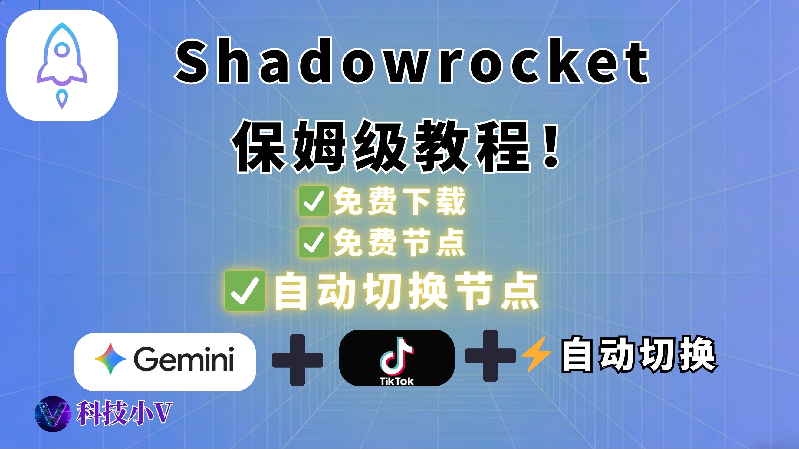

# 👉（小火箭）Shadowrocket保姆级教程：免费下载+「懒人配置」让节点自动切换！

{ width="300" align=left style="border-radius: 8px; margin-right: 20px; box-shadow: 0 4px 10px rgba(0,0,0,0.1); margin-bottom: 10px;" }

**本期要点：** Shadowrocket（小火箭）智能分流配置。本教程手把手带你通过验证，建议收藏！

  <a href="https://www.youtube.com/watch?v=-gTR97Wu1i8&t=12s" target="_blank" class="md-button md-button--neutral" style="display: inline-flex; align-items: center; gap: 8px; padding: 10px 24px; font-size: 0.85rem; border-radius: 20px; text-decoration: none; font-weight: bold; border: 1px solid rgba(0,0,0,0.1); transition: all 0.3s ease;">
    <svg viewBox="0 0 576 512" style="height: 1.1em; fill: #FF0000; margin: 0; display: block;"><path d="M549.655 124.083c-6.281-23.65-24.787-42.276-48.284-48.597C458.781 64 288 64 288 64S117.22 64 74.629 75.486c-23.497 6.322-42.003 24.947-48.284 48.597-11.412 42.867-11.412 132.305-11.412 132.305s0 89.438 11.412 132.305c6.281 23.65 24.787 41.5 48.284 47.821C117.22 448 288 448 288 448s170.781 0 213.371-11.486c23.497-6.321 42.003-24.171 48.284-47.821 11.412-42.867 11.412-132.305 11.412-132.305s0-89.438-11.412-132.305zm-317.51 213.508V175.185l142.739 81.205-142.739 81.201z"/></svg>
    立即观看完整视频
  </a>

 
<!-- more -->
---

## **第一：下载、安装小火箭（Shadowrocket）**
- 1.【免费方案】Toronto免费共享苹果ID网站：[点击跳转](https://idshare001.me/goso.html)
- 2.【免费方案】TK宝盒免费共享苹果ID网站：[点击跳转](https://tkbaohe.com/Shadowrocket/)
- 3.【付费方案】推荐账号平台： [账号星球](http://accboy7kjxv.acceboy.com)

## **第二：界面设置与节点添加**
- 1.【免费方案】免费节点订阅地址：https://openproxylist.com/v2ray/rawlist/subscribe
- 2.【免费试用+付费方案】Kookeey海外住宅IP，适合运营Tiktok等对IP要求高的情况：[点击跳转](https://www.kookeey.com/register.html?aff=86916142)

## **第三：核心配置：懒人分流与自动切换**
- 1.最完善的iOS Shadowrocket规则：[点击跳转](https://github.com/Johnshall/Shadowrocket-ADBlock-Rules-Forever)

### **合规与免责声明**
- 本文仅为网络技术科普，不构成任何使用建议。
- 中国大陆对网络接入与跨境通信有严格法律要求，请严格遵守相关法律法规。
- 文中所涉“机场”“VPS”等仅为技术概念介绍，并非鼓励或引导实际使用。
