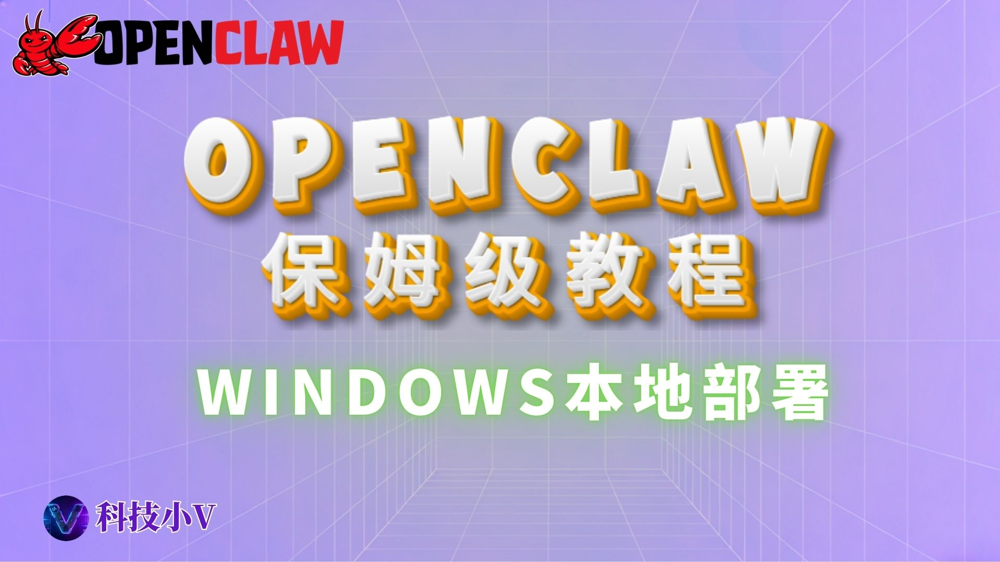

# 🦞OpenClaw保姆级安装教程：Windows用户必看，本地AI助手零门槛上手 

{ width="300" align=left style="border-radius: 8px; margin-right: 20px; box-shadow: 0 4px 10px rgba(0,0,0,0.1); margin-bottom: 10px;" }

**本期要点：** 小龙虾 Windows安装教程。本教程手把手带你通过验证，建议收藏！

<div style="margin-top: 25px; text-align: center;">
  <a href="https://www.youtube.com/watch?v=YbGr_9poheM&t=84s" target="_blank" class="md-button md-button--neutral" style="display: inline-flex; align-items: center; gap: 8px; padding: 10px 24px; font-size: 0.85rem; border-radius: 20px; text-decoration: none; font-weight: bold; border: 1px solid rgba(0,0,0,0.1); transition: all 0.3s ease;">
    <svg viewBox="0 0 576 512" style="height: 1.1em; fill: #FF0000; margin: 0; display: block;"><path d="M549.655 124.083c-6.281-23.65-24.787-42.276-48.284-48.597C458.781 64 288 64 288 64S117.22 64 74.629 75.486c-23.497 6.322-42.003 24.947-48.284 48.597-11.412 42.867-11.412 132.305-11.412 132.305s0 89.438 11.412 132.305c6.281 23.65 24.787 41.5 48.284 47.821C117.22 448 288 448 288 448s170.781 0 213.371-11.486c23.497-6.321 42.003-24.171 48.284-47.821 11.412-42.867 11.412-132.305 11.412-132.305s0-89.438-11.412-132.305zm-317.51 213.508V175.185l142.739 81.205-142.739 81.201z"/></svg>
    立即观看完整视频
  </a>
</div>

<br clear="left">
<!-- more -->
---

## **所需工具**
- 1.openclaw官网：[点击跳转](https://openclaw.ai/)
- 2.Node.js官网（中国区）：[点击跳转](https://nodejs.org/zh-cn)
- 3.Git应用下载地址：[点击跳转](https://git-scm.com/)
<hr class="sep">

## **视频用到的命令**
- Node版本检查命令：
```
node -v
```
- Git版本检查命令：
```
git --version
```
- Windows开启脚本权限命令：
```
Set-ExecutionPolicy -ExecutionPolicy RemoteSigned -Scope CurrentUser
```
- Windows权限检查命令：
```
Get-ExecutionPolicy -Scope CurrentUser
```
（如果显示RemoteSigned，就证明已开启成功）
- 安装Openclaw命令：
```
iwr -useb https://molt.bot/install.ps1 | iex
```
- Openclaw启动命令：
```
openclaw gateway
```
- 初始化node.js项目命令：
```
npm init -y
```
(如果如果提示缺少package.json时运行）
<hr class="sep">

### **合规与免责声明**
- 本文仅为网络技术科普，不构成任何使用建议。
- 中国大陆对网络接入与跨境通信有严格法律要求，请严格遵守相关法律法规。
- 文中所涉“机场”“VPS”等仅为技术概念介绍，并非鼓励或引导实际使用。

