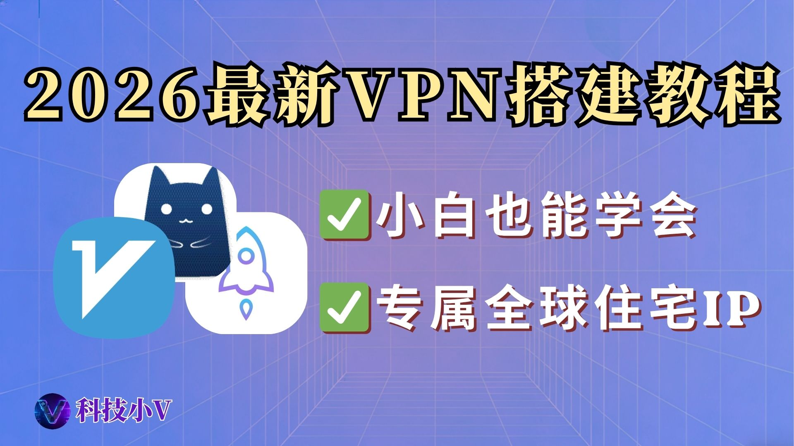

# 🌏【2026】最新VPN搭建教程：小白也能学会的云服务器自建梯子指南丨独享节点+全球住宅IP

{ width="300" align=left style="border-radius: 8px; margin-right: 20px; box-shadow: 0 4px 10px rgba(0,0,0,0.1); margin-bottom: 10px;" }

**本期要点：** 搭建专属的全球节点，有手就行！

<div style="margin-top: 25px; text-align: center;">
  <a href="https://youtu.be/15nfkz7M4Hk" target="_blank" class="md-button md-button--neutral" style="display: inline-flex; align-items: center; gap: 8px; padding: 10px 24px; font-size: 0.85rem; border-radius: 20px; text-decoration: none; font-weight: bold; border: 1px solid rgba(0,0,0,0.1); transition: all 0.3s ease;">
    <svg viewBox="0 0 576 512" style="height: 1.1em; fill: #FF0000; margin: 0; display: block;"><path d="M549.655 124.083c-6.281-23.65-24.787-42.276-48.284-48.597C458.781 64 288 64 288 64S117.22 64 74.629 75.486c-23.497 6.322-42.003 24.947-48.284 48.597-11.412 42.867-11.412 132.305-11.412 132.305s0 89.438 11.412 132.305c6.281 23.65 24.787 41.5 48.284 47.821C117.22 448 288 448 288 448s170.781 0 213.371-11.486c23.497-6.321 42.003-24.171 48.284-47.821 11.412-42.867 11.412-132.305 11.412-132.305s0-89.438-11.412-132.305zm-317.51 213.508V175.185l142.739 81.205-142.739 81.201z"/></svg>
    立即观看完整视频
  </a>
</div>

<br clear="left">
<!-- more -->
---


## 🎯 必备工具清单

在开始之前，请准备好以下工具和平台：

* **🌍 性价比-云服务器 (Vmiss)：** [点击获取您的中转服务器](https://app.vmiss.com/aff.php?aff=3992)
* **☁️ 均衡款-云服务器 (Jtti)：** [点击获取您的中转服务器（2.5折优惠码：kjxv2026）](https://www.jtti.cc?k=T7KBH7)
* **⚡️ 高质量（天花板）-海外老牌主机商（Banwagong）** [点击查看详情](https://tgl2775284503-hash.github.io/blog/tools/2026-04-25-VPS-banwagong/)

---

* **🏠 住宅代理 (Talor邀请码：xiaov001)：** [点击注册获取高质量动态/静态 IP](https://dashboard.talordata.com/reg?inviter_code=xiaov001)
* **🍠住宅代理（Webshare）**：[点击获取-每月不到 6 元](https://www.webshare.io/?referral_code=apnsjeua21if)
* **🤺自用机场推荐**（白月光）：**[点击访问](https://www.sibker.com/register?invite_code=6AbO5kCw)
---

* **⚡ 测速工具 (Speedtest)：** [点击前往测速](https://www.speedtest.net/zh-Hans)
* **🔍 IP 纯净度检测 (Ping0)：** [点击查询节点 IP 信息](https://ping0.cc/)
* **🔨代理软件（V2rayN）:**[电脑端下载地址](https://github.com/2dust/v2rayN/releases/tag/7.20.4)
* **🔨代理软件（V2rayNG）:**[安卓手机下载地址](https://github.com/2dust/v2rayNG/releases/tag/2.0.18)
* **👉加入小V交流群➡️抽奖：**[https://t.me/xiaovchat](https://t.me/xiaovchat)

---

## 🛠️ 第一步：连接云服务器

打开本地电脑的命令行工具（推荐使用 Windows PowerShell 或 macOS Terminal），输入以下命令：

```powershell
ssh root@<您的服务器IP地址> -p 22
```

> **💡 操作提示：**
> 
> 1. 请将 `<您的服务器IP地址>` 替换为实际 IP。
> 2. 首次连接需输入 `yes` 确认指纹，随后**粘贴/盲打**输入 Root 密码即可登录。

---

## ⚙️ 第二步：选择核心部署方案

请根据您的技术基础，任选**其中一种**脚本在服务器运行：

### 🤺 方案一：Sing-box 纯内核 (💻 一键配置各代理软件节点)
* **特点：** 无网页后台，纯代码驱动。
* **优势：** 资源占用极低，适合低配服务器或追求极致纯净的硬核玩家。
* **部署命令：**
```bash
bash <(wget -qO- https://raw.githubusercontent.com/fscarmen/sing-box/main/sing-box.sh)
```

### 🤷‍♂️ 方案二：3x-ui 可视化面板 (🌟手动添加节点、更加灵活)
* **特点：** 自带 Web 图形界面。
* **优势：** 像设置路由器一样简单，后期管理、修改链式节点极方便。
* **部署命令：**
```bash
bash <(curl -Ls https://raw.githubusercontent.com/mhsanaei/3x-ui/master/install.sh)
```

---

## 🔧 常见排错 (FAQ)

**🚨 报错现象：** 云服务器重装系统后，SSH 连接提示 `WARNING: REMOTE HOST IDENTIFICATION HAS CHANGED!`

**🔍 报错原因：** 重装系统导致服务器的安全指纹更新了，属于正常拦截。

**✅ 解决办法：** 在本地 PowerShell 运行下方命令（请替换为报错的 IP）清除旧记录，即可重新连接：

```powershell
ssh-keygen -R 45.194.20.121
```

---

> **⚠️ 免责声明**
> 本文档及相关教程内容仅供计算机网络技术交流与学习测试使用。请务必严格遵守您所在国家或地区的法律法规，切勿用于任何非法用途。

